<link rel="stylesheet" href="./style.css"/>
v2025.11

Porta
===




## 1 目的
⠿ 本文件旨在定義一套**高彈性訊息整合服務**。該服務不僅是一套資料流轉工具，更是在複雜企業級架構中，扮演 _背景資料處理與整合調度 (Background Data Orchestration)_ 的核心角色。

系統採用**雙軌配置驅動機制 (Dual-Format Configuration Driven)**，透過 YAML 與 HCL 的職責分離設計，實現異質系統間資料流轉的自動化與高可用預處理。其核心目標如下：

  * **多源整合 (Multi-Source Ingestion)**： 統一接收並並行處理來自不同技術棧的佇列服務，包含 RabbitMQ、NATS、NSQ、Kafka 及 PostgreSQL CDC 等。
  * **靈活分流與編排 (Dynamic Routing & Forking)**： 支援將訊息精準轉發、分流或分支複製（Forking）至異構目標，如多類資料庫、下游佇列或 RESTful API。
  * **可程式化加工 (Scriptable Processing)**： 內建腳本支援，在訊息流轉中即時進行**格式轉換**（如 Unix Timestamp 轉 ISO 8601）、**數值調整**（如「秒」與「毫秒」單位的數值換算）與**業務邏輯過濾**。
  * **職責分離的雙軌配置 (Separation of Configuration Concerns)**： 區分「系統環境」與「業務數據流」，分別採用最適合的配置語言：
    * **系統基礎配置 (YAML)**： 專注於底層運行環境的靜態定義。包含服務本身的監聽 IP、Port、核心通訊協定、日誌儲存路徑（Log Path）以及動態插件驅動資料夾等系統級參數。
    * **資料管線定義 (HCL)**： 專注於高動態性的資料流拓撲編排。利用 HCL 的變數引用（Cross-reference）與強型別驗證特性，清晰宣告 `Source -> Pipeline -> Broker -> Sink` 的依賴關係，在載入期即可動態校驗複雜管線（如多對一合併 Merging）的路由正確性。
  * **多場景支援 (Scenario Versatility)**： 架構通用，可無縫適應 IoT 數據匯流、微服務非同步通訊與即時日誌處理等多元場景。


## 2 設計要求

### 2.1 核心設計原則 (Core Design Principles)
⠿ 本系統以「運行期零停機 (Runtime Zero-Downtime)」為核心，嚴格遵循以下三大動態演進原則：

   1. **動態拓撲編排 (Dynamic Orchestration)**：系統支援在運行期間不重啟進程，即時執行資料流（Pipeline）的新增、停用、恢復與節點調整。配置變更須平滑過渡（Graceful Transition），確保傳輸中數據不遺失。
   2. **驅動插件熱插拔 (Hot-Swappable Drivers)**：外部系統連接端（Source / Sink）與核心完全解耦。系統可在運行期動態載入/解除驅動程式，無需重新啟動，實現新興資料庫或佇列的零停機接入。
   3. **異質代理共存 (Multi-Broker Coexistence)**：系統支援在同一環境下，同時並存多種不同特性的內部中繼緩衝服務（如 NATS 與 RabbitMQ 共存）。中繼層驅動同樣支援動態載入，可因應業務場景無感切換緩衝機制。

### 2.2 數據流轉工作模型 (Data Flow Models)
⠿ 提供背景資料處理的數據流工作模型，同時扮演的「工作者 (Worker)」與「代理者 (Broker)」行為，滿足異質系統間的異步處理與同步需求。系統需支援以下七種主要工作型態，以涵蓋絕大多數的整合情境：

A. **工作者型態 (Worker Patterns)**<br>
   <section-content>負責處理資料的下游流轉與轉換，具體分為以下模式：</section-content>

   - **異步消費模式 (Consumer Mode)**<br>
     ▸ **路徑**：`Broker -> DB / API`<br>
     從訊息佇列（如 NATS, RabbitMQ）訂閱任務，經處理後寫入資料庫或驅動第三方 RESTful API。用於削峰填谷與非同步作業。
   - **訊息中繼模式 (Relay/Bridge Mode)**<br>
     ▸ **路徑**：`Broker -> Broker`<br>
     實現跨協議的訊息橋接（例如從 NSQ 轉發至 Kafka），用於異質傳輸介質間的通訊或跨雲環境的數據同步。
   - **異動訂閱模式 (CDC / Pub-Sub Mode)**<br>
     ▸ **路徑**：`DB -> DB / Broker / API`<br>
     基於資料庫異動訂閱（Change Data Capture, CDC），當資料庫欄位發生變更時，自動觸發下游同步或通知。
   - **主動輪詢與同步模式 (Polling/Sync Mode)**<br>
     ▸ **路徑**：`API / DB -> DB / Broker / API`<br>
     定時透過 API 抓取外部數據，進行清洗與處理後轉存至內部系統，確保本地數據與外部服務的最終一致性。另外亦支援對資料庫進行定期 Select（基於時間戳或 ID 增量），確保非即時異動的數據也能被拉取同步。
   - **實時串流觀測模式 (Stream Observation Mode)**<br>
     ▸ **路徑**：`Stdout / Stderr -> DB / Broker / API`<br>
     系統作為宿主或 Sidecar 運行，接管下游程序的標準輸出流。透過 Pipe (管道) 技術即時擷取輸出內容，結合「腳本管理器」進行正則解析 (Regex Parsing) 後，轉化為結構化訊息投遞。

B. **訊息代理型態 (Broker Patterns)**<br>
   <section-content>定義系統作為接收端時的角色：</section-content>

   - **生產者網關模式 (Producer/Ingress Mode)**<br>
     ▸ **路徑**：`API -> Broker`<br>
     系統提供標準化的 API 接口接收外部請求，並將載荷（Payload）封裝後投遞至內部緩衝佇列，實現請求與處理的解耦。
   - **數據代理轉發模式 (Data Forwarder Mode)**<br>
     ▸ **路徑**：`API -> DB / Broker / API`<br>
     系統扮演 透明代理 (Transparent Proxy) 或 協議轉換器 的角色。被動接收來自應用服務的請求，經由內部「腳本管理器」或「處理單元」即時運算後，直接轉發至目標端點。


### 2.3 資料管線配置與設計原則 (Data Pipeline Configuration & Design Principles)
⠿ 資料管線採用宣告式定義，旨在透過高內聚、低耦合的配置設計，建立具備高度重用性與動態驗證能力的背景資料整合拓撲。

A. **單向拓撲與多管線級聯 (Directional Topology & Cascade)**
   - **單向流向規範**：資料管線配置嚴格遵循單向流動原則，其核心節點路徑為：

      $$\text{Source} \longrightarrow \text{Source Pipeline} \longrightarrow \text{Broker} \longrightarrow \text{Sink Pipeline} \longrightarrow \text{Sink}$$

      管線完整涵蓋資料端點（Source, Sink, Broker）以及資料操作（分流、分支、過濾、轉換等）。
   - **虛擬端點級聯 (Pipeline Cascading)**：系統提供 Publisher (Sink 端點) 與 Subscriber (Source 端點) 兩個虛擬對接器。管線 A 可透過 Publisher 將加工後的數據投遞至內部 Broker，再由管線 B 的 Subscriber 訂閱接續處理。藉由這種級聯機制，可將多個簡單的子管線（Sub-pipelines）任意串聯，拼裝成複雜的分散式資料網狀拓撲。

   <section-content>
   <text-smaller>圖：系統資料處理節點與資料流向</text-smaller>
   </section-content>


B. **三大配置區塊切分 (Configuration Domain Separation)**<br>
   <section-content>為了保持拓撲邏輯的清晰度並最大化配置重用率，HCL 配置檔結構嚴格劃分為以下三個核心區塊：</section-content>
   - **資源區塊 (Resource Block)**<br>
     ▸ **定位**：靜態共用基礎設施宣告。<br>
     配置所有外部服務的實體連線資訊（Connection Strings）、認證憑證、環境變數與驅動程式參數（涵蓋 Source、Sink 與 Broker）。此區塊與業務邏輯解耦，便於跨管線共用。
   - **管道處理區塊 (Pipe Block)**<br>
     ▸ **定位**：有狀態與複雜運算擴充。<br>
     定義具備「時間視窗」或「狀態鎖定」的進階資料處理管道。例如批次打包（Packing）、時窗聚合（Aggregating）、多源合併（Merging）以及商務整合邏輯（Integrating）。透過獨立宣告，使複雜的後處理邏輯能被多條資料流動態引用。
   - **管線拓撲區塊 (Pipeline Block)**<br>
     ▸ **定位**：資料流向與動態編排核心。<br>
     負責定義處理節點的串聯關係（Topology）。在此區塊中，僅**透過「名稱（Name/ID Reference）」來強型別引用** Resource 與 Pipe 區塊的配置，專注於勾勒資料的進入、清洗、中繼與投遞路徑。

C. **配置期動態驗證能力 (Compile-Phase Dynamic Validation)**<br>
   <section-content>為確保 24/7 不間斷運維與動態載入（Hot-Reload）的安全性，系統在「配置載入階段」（數據實時流入前）即觸發**拓撲級別的防禦性動態驗證**：</section-content>
   - **懸空與孤兒節點檢查 (Reference Validation)**：嚴格校驗 Pipeline 區塊所引用的 Resource 或 Pipe ID 是否真實存在；同時偵測未被引用的無效配置，拒絕未知端點與資源浪費。
   - **型別與結構相容性 (Type Compatibility)**：靜態審查上下遊節點的輸出入型別契合度（例如：當 Sink 只接受單筆 Object，而上游 Pipe 卻輸出 Array 批次時自動攔截），並校驗 Merging 等有狀態節點所需的 correlation_key 是否確實存在於上游 Schema 中。
   - **表達式與環境變數預編譯 (Expression Resolving)**：提前執行配置內的算術、邏輯表達式與內建函數合法性檢查，並實時校驗動態環境變數的存在性，防止運行期因憑證缺失遺漏而崩潰。
   - **DAG 環路偵測 (Circular Dependency Detection)**：將多管線級聯拓撲於記憶體中繪製為**有向無環圖 (DAG)**，利用拓撲排序演算法在載入期切斷任何可能導致訊息無限迴圈的閉環路由。

D. **高級語法與動態表達式 (Advanced Lexical & Expressions)**<br>
   <section-content>配置引擎必須具備高度的動態能力，配置語法需原生支援以下特性：</section-content>
   - **動態變更**：支援讀取作業系統環境變數（Environment Variables）與配置內自定義變數（Local Variables）。
   - **樣板與運算**：支援文字格式化樣板（String Templates），以及運行期的算術表達（Arithmetic）、邏輯判斷表達（Logical）與內建函數（Functions，如字串處理、雜湊計算、時間格式化）。
   - **多模態流控**：語法必須能完美表達各種無狀態分流（Forking, Dispatching）與有狀態匯流（Packing, Aggregating, Merging, Integrating）的配置參數。

E. **統一高效序列化規範 (Serialization Specification)**
   - **MessagePack 標準化**：為了追求極致的傳輸效能與降低記憶體足跡（Memory Footprint），**資料管道內部流轉的訊息紀錄一律強制採用 MessagePack 編碼**。
   - **動態適配**：外部傳入的異質資料（如 JSON, XML, Protobuf）在通過 Source Ingestion 層後，系統會立即將其轉碼為 MessagePack 二進制格式，直至最終投遞（Delivery Layer）前才依據 Sink 要求進行反序列化或轉碼，確保核心引擎維持最高吞吐量。


### 2.4 資料管線控制與支援 (Data Pipeline Control & Support)
⠿ 系統在日常運維、系統維護、異常容錯以及上線測試時的控制機制與支援工具，確保資料管線具備企業級的「可觀測性」與「高可維護性」。

A. **多模態生命週期管理 (Pipeline Lifecycle Modes)**<br>
   <section-content>系統支援對核心資料管線（Pipeline）及子管線（Sub-pipelines）進行動態模式切換，具備以下三種運行模態：</section-content>
   - **運行模式 (Active Mode)**：管線全功能正常運作，資料即時進行「擷取 $\rightarrow$ 預處理 $\rightarrow$ 中繼 $\rightarrow$ 後處理 $\rightarrow$ 推送」。
   - **停用模式 (Disabled Mode)**：管線徹底關閉。來源擷取層（Ingestion Layer）停止接收實體訊號，中繼 Broker 停止運作，釋放相關連線與記憶體資源。
   - **維護模式 (Maintenance Mode)**：
      - **核心機制**：**「保持輸入，中斷後處」**。此模式下，來源擷取層維持與外部數據源的連接並持續接收訊息，但一律將訊息積壓（Buffer）於內部中繼 Broker 中，暫停後處理層與主動推送層的動作。
      - **恢復機制**：當管線切換回「運行模式」時，後處理層將以「削峰填谷」的方式，平滑消化維護期間積壓在 Broker 中的暫存數據，確保維護期間業務資料零遺失。

B. **自動化排程調度 (Automated Schedule Control)**
   - **定時切換任務**：系統內建排程引擎（Cron-like Scheduler），允許運維人員預先配置排程原則。
   - **應用場景**：可在指定的離峰時間段（如凌晨 02:00 - 04:00）自動將特定管線切換至「維護模式」進行下游系統保養，並於指定時間自動恢復「運行模式」，實現自動化運維。

C. **虛擬試駕與樣本仿真 (Dry-Run & Sandbox Simulation)**<br>
   <section-content>為了降低新管線或新腳本上線的風險，系統必須提供無副作用的模擬環境：</section-content>
   - **黑盒模擬 (Dry-Run)**：允許在不影響生產環境的前提下，將測試訊息輸入指定的資料管線，逐層模擬並輸出原始數據在轉換、過濾、分支（Forking）及合併（Merging）等各節點處理後的結果，但最終不寫入實體 Sink。
   - **數據仿真生成 (Data Mocker)**：若用戶配置了資料結構定義（Schema Definition），試駕引擎須支援依據欄位型別與規則，自動隨機產生符合規範的樣本資料（Mock Data），用以壓力測試或驗證管線拓撲邏輯。

D. **異常訊息管理與死信補丁 (Exception Handling & Dead Letter Routing)**<br>
   <section-content>資料在任何節點處理失敗時，系統需具備完善的容錯與救回機制：</section-content>
   - **補丁管線路由 (DLQ Routing)**：收集在預處理、腳本運算、合併或投遞階段發生異常（如格式出錯、網路超時）的訊息。系統不直接丟棄，而是將其封裝並附加錯誤上下文（Error Context）後，轉入獨立的「補丁資料管道（Dead Letter Queue, DLQ）」。
   - **介入與處置 (Resolution)**：運維人員可針對補丁管道內的異常訊息進行管理：
     - **線上修正**：引流至特殊的補丁資料節點，透過專門的腳本修正資料缺陷後，重新投遞回原管線。
     - **手動移除**：判定為無效雜訊後進行審計歸檔並手動移除。

E. **管道流量動態限流 (Dynamic Rate Limiting)**<br>
   <section-content>支援在運行期間對特定管線的 Source 或是 Sink 進行動態限流配置（如限制每秒最大吞吐量為 500 ops）。當下游第三方 API 發生頻寬載飽或觸發 HTTP 429 (Too Many Requests) 時，系統能動態限速，將流量壓力安全反壓（Backpressure）回內部的中繼 Broker。</section-content>

F. **資料血緣與軌跡追溯 (Data Lineage & Message Tracking)**<br>
   <section-content>在資料平面內部，每筆 MessagePack 紀錄除了 Payload，皆須強制附帶系統元數據（Metadata），包含 Message ID 與 Timestamp。系統需紀錄該訊息「由哪個 Source 進來、經過哪個 Script 過濾、最後進到哪個 Broker 與 Sink」，提供全局的資料血緣軌跡，便於維運排查。</section-content>

G. **監控指標與健康度探針 (Metrics & Health Probes)**<br>
   <section-content>管線各處理節點需實時統計並暴露（Expose）效能指標，包含流入/流出速率（Throughput）、處理延遲（Latency）、異常錯誤率（Error Rate）以及內部中繼 Broker 的訊息積壓量（Lag）。系統需提供標準探針，以便與 Prometheus / Grafana 等外部監控系統整合告警。</section-content>


### 2.5 資料傳輸擔保 (Data Delivery Guarantees)
⠿ 系統在不同運作模式下，對於訊息從來源端（Source）到目標端（Sink）流轉過程中的可靠性承諾、時間調度與異常容錯要求。

A. **延遲與定時發送機制 (Deferred Message Delivery)**<br>
   - **設計要求**：當系統運作於「生產者網關模式（Producer/Ingress Mode）」時，系統須支援延遲發送參數。
   - **技術規格**：
      - 外部應用透過 API 投遞訊息時，可於 Header 或 Payload 中指定延遲時間（如：`X-Delay: 300s`）或指定特定時間戳（Epoch Timestamp）。
     - 核心引擎在接收後，須將訊息安全封存於具備時序調度能力的中繼 Broker 中，直到觸發時間點才流向後續管線，用以支援非即時性的背景異步處理。

B. **多模態交付確認與可靠性策略 (Multi-Mode Delivery Acknowledgement)**<br>
   <section-content>系統須根據數據流的驅動型態，切換對應的交付擔保機制，以確保傳輸鏈路的完整性：</section-content>
   - **被動接收端點（Gateway / Forwarder 模式）**：
      - **擔保策略**：*雙向確認 (Two-way Ingress ACK)*
      - **機制規範**：當外部服務向本系統投遞訊息（如透過 RESTful API 或 RESP 3 協定），核心引擎在接收後，必須成功解析並確認安全寫入內部中繼 Broker 的持久化存儲後，才向呼叫端回傳成功確認碼（如 RESP 3 的 `+OK` 或 HTTP `202 Accepted`）；若寫入失敗或超時，則回傳錯誤，強制要求客戶端重試，確保數據進入系統邊界時的零遺失。
   - **主動投遞端點（Worker / Push 模式）**：
      - **擔保策略**：*帶抖動的指數退避重試 (Exponential Backoff with Jitter)*
      - **機制規範**：當本系統作為 Worker 主動將訊息投遞至外部目的地（如實體資料庫、第三方 Webhook）時，若遭遇網路波動或目標端暫時性失效，系統必須啟動指數退避重試策略。運維人員可透過 HCL 配置最大重試次數與初始延遲，避免盲目密集重試引發對目標端的分布式拒絕服務（DDoS），並在重試耗盡後將訊息安全轉入死信管線（DLQ）。
   - **被動消費端點（Consumer / Pull 模式）**
     - **擔保策略**：*租約鎖定與消費確認 (Visibility Lease & Egress ACK)*
     - **機制規範**：當外部應用服務作為消費者，主動透過本系統提供的協定介面（如透過 RESP 3 的自訂消費命令）拉取中繼 Broker 內的訊息時，系統必須採用「無損消費確認機制」：
       - **可見度鎖定 (Visibility Timeout)**：當外部消費者拉取走一筆訊息後，該訊息在 Broker 中不會立刻被刪除，而是進入「隱身狀態（租約鎖定）」，在配置的時間（如 30 秒）內，其他並行消費者無法看見或拉取該訊息。
       - **消費確認 (ACK)**：外部消費者成功處理完業務邏輯後，必須向本系統發送一條專屬的確認指令（如 `MSG_ACK <message_id>`）。系統收到此 ACK 後，才正式將該訊息自內部中繼 Broker 中物理移除。
       - **超時重回佇列 (Timeout Re-queue)**：若外部消費者在租約時窗內因當機、網路中斷而未發送 ACK，該訊息將自動恢復為「可見狀態」，重新開放給其他健康的消費者拉取，確保在客戶端崩潰時訊息能被保底消費。

C. **傳輸層級擔保與冪等性 (Delivery Semantics & Idempotency)**
   - **設計要求**：系統預設必須達到 **At-least-once（至少一次）** 的傳輸擔保，確保在任何節點崩潰時，訊息絕不遺失。
   - **防禦機制**：由於 At-least-once 可能因網路重試導致訊息重複投遞，系統在 Data Processor 階段必須內建**冪等性校驗器（Idempotency Filter）**。系統支援依據配置的 Unique Key（如訂單 ID）結合 Redis 等分散式快取進行去重處理，確保下游（Sink）不會因重複訊息導致業務資料異常。

D. **背壓防禦與流量控制 (Backpressure & Flow Control)**
   - **設計要求**：系統必須具備端到端（End-to-End）的背壓（Backpressure）傳導機制。
   - **防禦機制**：當下游（Sink）寫入速度慢、或是外部 API 觸發限流時，後處理層與推送層必須能將阻塞訊號「安全反壓」回內部中繼 Broker，利用 Broker 的積壓緩衝能力將流量鎖定在存儲層，而**絕不允許阻塞核心引擎的記憶體空間**，防止因單一管線阻塞引發整機 OOM (Out of Memory) 崩潰。

E. **斷點續傳與自我修復 (Checkpointing & Self-Healing)**
   - **設計要求**：在 `DB CDC` 或 `Broker -> Broker` 等持續串流場景中，系統必須具備狀態檢查點（Checkpointing）機制。
   - **防禦機制**：系統須定期將當前消費的進度（如 Kafka Offset、MySQL Binlog Position 或 Redis Stream ID）持久化記錄於 **State Store** 中。當本系統因伺服器斷電、重啟或 pod 漂移而中斷後，新啟動的節點能自動讀取 Checkpoint，從斷點處**無縫續傳**，避免資料漏讀。

F. **優雅停機與動態排空 (Graceful Shutdown & Drain)**
   - **設計要求**：當運維人員下達「停用管線」或「更新系統」指令時，核心引擎必須執行**優雅關閉流程（Graceful Shutdown）**。
   - **防禦機制**：來源擷取層（Source）會第一時間切斷外部新流量的進入，但系統**不會立刻殺死進程**，而是給予配置的寬限時間（如 30 秒），允許正在 `Pipeline` 內部進行格式轉換、合併（Merging）或正在重試投遞的殘留訊息「全數處理並排空（Drain）」完畢後，進程才正式退出，確保維運動作不對數據完整性造成破壞。


### 2.6 通訊協定與介面規範 (Communication Protocols & Interfaces)
⠿ 為了確保系統的擴充性、高可用性以及對多語言生態的友好度，系統將通訊架構劃分為三個獨立層面，並全面採用業界標準協定，以「零客戶端開發成本 (Zero-Client Overheads)」為核心設計原則。

A. **管理層面 (Management Plane)**<br>
   <section-content>負責動態調度系統的生命週期，包含資料流拓撲（Pipeline Topology）的動態變更（新增、刪除、更新、暫停、恢復），以及驅動插件（Source/Sink Plugins）的熱插拔管理。</section-content>

   <section-item>▸ **協定類型**：</section-item>
   - **HTTP/JSON (RESTful API)**：提供給管理後台、前端 UI 或 CI/CD 自動化腳本呼叫，具備最高的通用性。
   - **gRPC (HTTP/2)**：提供給內部微服務或自動化運維工具進行高效率、強型別的程式化控制。

B. **控制層面 (Control Plane)**<br>
   <section-content>在多節點分散式部署環境下，負責叢集狀態同步、節點存活檢查（Heartbeat）、以及資料流拓撲配置的分散式共識傳播。</section-content>

   <section-item>▸ **協定類型**：</section-item>
   - **Gossip Protocol (流言協定)**：採用去中心化的 Gossip 機制（如基於 Memberlist 實作）。節點間透過點對點的隨機通訊，以 O(log N) 的收斂速度達成叢集狀態最終一致性。此舉可避免單點故障（SPOF），確保核心引擎的大規模橫向擴充能力。

C. **資料層面 (Data Plane)**<br>
   <section-content>提供核心的資料生產（Produce）、消費（Consume）以及連線動態探測（Ping/Pong）操作。</section-content>

   <section-item>▸ **協定類型與核心架構策略**：</section-item>
   <section-content>本系統不自行定義私有二進制協定，而是透過「協議適配層（Protocol Adapters）」直接相容現有的標準通用協定。此設計允許開發者直接使用現成、成熟的第三方 SDK，徹底免除為各程式語言研發專屬 Client 套件的維護成本：</section-content>

   - **RESP 3 (Redis Serialization Protocol v3)**<br>
     ▸ **策略價值**：利用 Redis 生態的普適性。在大多數語言的 Redis Client 中，皆提供如 redisCommandArgv()（如 C 語言的 hiredis）或 Do() / Raw() 等低階函式。本系統將自定義擴充指令（例如：`MSG_PRODUCE <stream> <payload>` 或 `MSG_CONSUME <stream>`），用戶端只需透過既有的 Redis SDK 發送原始指令即可直接操作本服務。
   - **AMQP 0.9.1 (Advanced Message Queuing Protocol)**<br>
     ▸ **策略價值**：相容 RabbitMQ 生態。系統對外模擬為標準 Broker，允許現有的企業遺留系統直接以標準 AMQP 驅動將資料投遞至本服務。
   - **HTTP/REST & gRPC**<br>
     ▸ **策略價值**：針對輕量級的微服務或無狀態應用（如 Serverless FaaS），提供傳統的 Webhook 接收與發送能力，兼顧便利性與極致效能。


## 3 設計構想
⠿ 系統採用**插件式核心架構(Plug-in Architecture)**，核心引擎僅負責生命週期調度與流控，將業務邏輯、通訊協定與資料完全解耦。服務內部配置可替換的第三方佇列服務作為訊息流轉的中繼緩衝，這個設計組合賦予服務更多的可能性。

⠛ **核心技術特性**
   - **動態擴展與熱插拔 (Hot-swappable)**<br>
     利用 Golang Plugin 與 gRPC 介面定義，實現驅動庫的動態載入。系統無需停機即可擴充對新興 Broker（如 NATS, NSQ, RabbitMQ）或資料庫的支援，確保高可用環境下的服務連續性。
   - **異質服務共存與靈活中繼**<br>
     支援多種第三方佇列服務同時並存，並將其作為訊息流轉的中繼緩衝。這使系統能因應不同業務場景（如：高吞吐量的日誌流 vs. 極低延遲的指令流）配置最合適的中繼介質，解決複雜易變的整合需求。
   - **計算與存儲解耦 (Stateless vs. Stateful)**<br>
     將「有狀態」的訊息存儲與「無狀態」的處理邏輯完全分離。核心程式不維護長期狀態，將資料持久化、負載平衡與故障移轉（Failover）交由專門的佇列服務處理，極大化降低主體設計的複雜度。

⠛ **維運與資源優勢**
   - **資源配置精準化**<br>
     主程式與存儲層分離後，可針對不同瓶頸進行精準配比。
      - **設備優化**：主程式（CPU/Memory 密集型）與佇列服務（I/O/Disk 密集型）可運行於不同規格的硬體節點。
      - **彈性伸縮**：支援獨立橫向擴展，根據流量負載分別調整主程式副本數或存儲叢集規模。
   - **管理權責清晰化 (DevOps Alignment)**
      - **基礎設施層**：由 SRE 團隊管理具狀態的佇列服務，確保資料可靠性與備份。
      - **業務邏輯層**：主程式視為標準無狀態服務，由開發團隊透過 CI/CD 快速迭代，提升業務響應速度。

### 3.1 模組組成

   * **Core Engine (核心引擎)**： 負責解析 YAML 配置文件、初始化 Pipeline、生命週期管理及監控指標收集。
   * **Plugin Provider (插件提供者)**： 透過 Golang Plugin 或 gRPC 介面定義的驅動程式，負責與外部佇列服務/資料庫異動通知/內部第三方佇列 Broker（如 NATS, NSQ, RabbitMQ）進行實體連接。
   * **Data Processor (資料處理單元)**： 負責處理資料轉換，包含無狀態(Stateless)的預處理邏輯（如 JSON 轉換、欄位映射、過濾、加解密），以及有狀態(Stateful)的加工處理（如 打包、聚合）。
   * **State Store (狀態存儲)**：記錄當前批次處理階段尚未發送的暫存資料，或聚合運算的累加值。
   * **Scripting Engine Manager (腳本管理器)**：負責載入、初始化與執行腳本。
   * **Pipeline Manager**： 管理/調度「來源 (Source) $\rightarrow$ 處理 (Process) $\rightarrow$ 目標 (Sink)」的資料流向。

### 3.2 資料處理邏輯分層
⠿ 系統縱向邏輯分層遵循解耦原則劃分，確保訊息處理的高可用性與橫向擴展能力，整體邏輯由前到後分為以下五個階段：

   1. **來源擷取層(Data Ingestion Layer)**<br>負責建立與外部數據源的連接，實現非同步的資料獲取。
      - **介接對象**： 外部消息隊列（如：Kafka, RabbitMQ）或資料庫異動追蹤（如：PostgreSQL CDC）。
      - **核心功能**： 確保原始數據（Raw Data）穩定流入系統，並處理底層連接的重試與容錯機制。
   2. **預處理層(Pre-processing Layer)**<br>根據預定義的業務邏輯，對原始訊息進行初步的篩選與標準化。
      - **分支 (Forking)**： 系統會複製（Clone）多個副本，同時投遞至多個不同的下游管道。
      - **分流 (Dispatching)**： 依據訊息標籤或屬性導向不同的處理路徑。
      - **過濾 (Filtering)**： 剔除無效或不符合條件的雜訊訊息。
      - **轉換 (Converting)**： 統一資料格式（如 Protobuf 轉 JSON），確保後續處理的一致性。
   3. **緩衝傳輸層(Message Broker Layer)**<br>作為系統內部的訊息持久化儲存單元，將處理過的訊息暫存在高可靠的內部佇列中。
      - **核心技術**： 採用第三方訊息佇列（如：RabbitMQ, NATS）作為內部緩衝。
      - **核心價值**：
        - 實現前後端解耦，平衡生產者與消費者的速度差異（削峰填谷），並提供訊息持久化保障。
        - 實現訊息儲存內容的資料副本、負載平衡、故障移轉…等高可用性與可靠性保障。
        - 實現服務能以更靈活的方式選擇或混合各種訊息佇列服務，對應各式不同使用的場景或更複雜的混合場景。
   4. **後處理層(Post-processing Layer)**<br>針對特定業務場景進行深度的訊息加工。
      - **打包 (Packing)**： 將多筆小訊息封裝為批次，以提升下游寫入效率。
      - **聚合 (Aggregating)**： （預留擴展）支持時窗運算，針對特定欄位進行加總或統計處理。
      - **合併 (Merging)**： （預留擴展）針對具有相同資料結構的多個來源訊息混合成一個單一資料流。
      - **整合 (Integrating)**： （預留擴展）針對具有相同關聯鍵（Correlation ID）的多個來源訊息，在特定時窗內進行等待與匯合，產出完整的「全景訊息」。
   5. **主動推送層(Delivery Layer)**<br>最終根據配置協議，將加工後的訊息精準投遞至目標端點。
      - **推送對象**：
        - **持久層**： 寫入指定的資料庫。
        - **消息層**： 轉發至其他消息隊列服務。
        - **應用層**： 透過 RESTful API 或 Webhook 主動觸發業務應用服務。


## 4 系統設計

### 4.1 資料管線配置

#### 4.1.1 資源配置檔 (Resource)
⠛ 配置 *共用資源* 的區段。

   -  **格式**：
      ```hcl
      var {
         ...
      }

      service <SERVICE-TYPE> "<SERVICE_NAME>" {
         ....
      }
      ```
   - **區段**：
      - **var**：配置 *環境變數* 與 *共用變數*。
      - **service**：配置 *Source/Sink/Broker* 服務。


##### 4.1.1.1 共用變數配置
⠛ 配置 *環境變數* 與 *共用變數* 的區段。

   ▸ **區段名稱**： `var`
   -  **格式**：
      ```hcl
      var {
         <VAR_NAME> = Expression
         ...
      }
      ```

   - **變數數值**：<br>
     變數數值接受 HCL Expression 表達式，包含變數、樣板、算術運算、數值、函式…等。變數可接受的數值如下：
      | 型別      | 範例           |
      |----------|:---------------|
      | null     | `foo = null`
      | boolean  | `foo = true`
      | number   | `foo = -3.14`
      | string   | `foo = "foo"`
      | duration | `foo = 30s` ⚠️標準 HCL 不支援
      | disksize | `foo = 10mb` ⚠️標準 HCL 不支援
      | tuple    | `foo = [ foo, bar ]`
      | object   | `foo = { foo = 1, bar = 2}`
   - **環境變數**：<br>
     使用函式表達式 `env()` 設定。使用方式如下：

     `env("<ENVIRONMENT_VARIABLE_NAME>")`

      > 📝 `env()`函式只能在 var 區段內使用。另該函式會強制檢查環境變數是否存在，若不存在無法載入配置檔。


##### 4.1.1.2 服務配置
⠛ 配置 *Source/Sink/Broker* 服務的區段。

   ▸ **區段名稱**： `service`
   -  **格式**：
      ```hcl
      service <SERVICE-TYPE> "<SERVICE_NAME>" {
         address  = "mq://xxxx,mq://yyyy,mq://zzzz"
         user     = ...
         password = ...
         database = ...
         timeout  = ...  // connection timeout

         certificate     = ...
         certificate_key = ...
      }
      ```
      - 服務類型由 `<SERVICE-TYPE>` 指定（如 http、postgresql、rabbitmq）。
      - 每個服務由 **service 區段** 命名唯一的 `<SERVICE_NAME>` 名稱，該名稱作為 [4.1.3 資料管線配置檔 (Pipeline)](#413-資料管線配置檔-pipeline) 的引用。
   - **屬性**：
      - **address** <sup>`string`</sup>：設定服務的連線類型、網路位置、連接埠。
      - **user** <sup>`string`</sup>：設定服務的連線帳戶。
      - **password** <sup>`string`</sup>：設定服務的連線密碼。
      - **database** <sup>`string`</sup>：設定服務的連線預設資料庫，適用於資料庫服務。
      - **timeout** <sup>`duration`</sup>：設定服務的連線逾時值。
      - **certificate** <sup>`string`</sup>：設定服務連線認證憑證檔位置。
      - **certificate_key** <sup>`string`</sup>：設定服務連線認證憑證金鑰內容。


#### 4.1.2 管道配置檔 (pipe)
⠛ 配置 *資料管道* 的區段，處理有狀態且跨訊息或跨資料來源的複雜運算。

   ▸ **區段名稱**： `pipe`
   -  **格式**：
      ```hcl
      pipe "<PIPE_NAME>" {
         #!use_number_sequence for pipe_id

         workflow = [ "<LOCAL_PIPE_ID>",... ]

         packing "<LOCAL_PIPE_ID?>" {
            ...
         }
         aggregating "<LOCAL_PIPE_ID?>" {
            ...
         }
         merging "<LOCAL_PIPE_ID?>" {
            ...
         }
         integrating "<LOCAL_PIPE_ID?>" {
            ...
         }

         sink <SINK-TYPE> {
            ...
         }
      }
      ```
      每個管道由 **pipe 區段** 命名唯一的 `<PIPE_NAME>` 名稱，該名稱作為 [4.1.3 資料管線配置檔 (Pipeline)](#413-資料管線配置檔-pipeline) 的引用，也可以接受其它 **pipe 區段** 引用。
   - **屬性**：
      - **next** <sup>`string`</sup>：設定本管道得出運算結果後，指定 `<PIPE_NAME>` 所代表的 *pipe 區段* 接手後續處理。
      - **workflow** <sup>`tuple`</sup>：安排管道內所屬 `LOCAL_PIPE_ID` 所代表的子管道的運算優先順序。
   - **區段**：
      - **packing**：打包處理管道類型配置。見 [4.1.2.1 packing 管道類型配置](#4121-packing-管道類型配置)。
      - **aggregating**：聚合處理管道類型配置。見 [4.1.2.2 aggregating 管道類型配置](#4122-aggregating-管道類型配置)。
      - **merging**：合併處理管道類型配置。見 [4.1.2.3 merging 管道類型配置](#4123-merging-管道類型配置)。
      - **integrating**：整合處理管道類型配置。見 [4.1.2.4 integrating 管道類型配置](#4124-integrating-管道類型配置)。
      - **sink**：sink 管道類型配置。見 [4.1.3.1 sink 輸出端點配置](#4131-sink-輸出端點配置)。


##### 4.1.2.1 packing 管道類型配置
⠛ 配置打包處理管道。

   ▸ **區段名稱**： `packing`
   -  **格式**：
      ```hcl
      packing "<LOCAL_PIPE_ID?>" {
         field = {
            $        : [ (key), <FIELD_NAME>,... ]  // 滙入所選欄位
            key      : [ <FIELD_NAME>,... ]         // 主鍵欄位
            "<FIELD>": packing-id | ...             // 打包識別碼，⚠️HCL 不支援
            "<FIELD>": <TYPE?> | [ <VALUE_PROCESSOR>, ... ]
                     ? <DEFAULT_VALUE or FIELD>     // ⚠️ HCL 不支援
         }

         min_time    = ...
         max_time    = ...
         min_records = ...
         max_records = ...
         min_bytes   = ...
         max_bytes   = ...
      }
      ```
      packing 管道類型能夠命名所屬父層級 **pipe 區段** 內唯一的 `<LOCAL_PIPE_ID>` 名稱，該名稱作為所屬 **pipe 區段** 內 **workflow** 屬性定義運算順序使用。
   - **屬性**：
      - **field** <sup>`object`</sup>：設定紀錄所需的資料欄位、欄位型別、欄位處理器或預設值。
      - **min_time** <sup>`duration`</sup>：設定觸發打包的最小等待時間。
      - **max_time** <sup>`duration`</sup>：設定觸發打包的最大等待時間。
      - **min_records** <sup>`number`</sup>：設定觸發打包的最小紀錄筆數。
      - **max_records** <sup>`number`</sup>：設定觸發打包的最大紀錄筆數。
      - **min_bytes** <sup>`disksize`</sup>：設定觸發打包的最小容量。
      - **max_bytes** <sup>`disksize`</sup>：設定觸發打包的最大容量。

##### 4.1.2.2 aggregating 管道類型配置
⠛ 配置聚合處理管道。

   ▸ **區段名稱**： `aggregating`
   -  **格式**：
      ```hcl
      aggregating "<LOCAL_PIPE_ID?>" {
         field = {
            key       : [ <FIELD_NAME>,... ]
            "<FIELD>" : <AGGREGATION_EXPRESS>
         }

         window <WINDOW-FUNCTION> {
            ...
         }
      }
      ```
      aggregating 管道類型能夠命名所屬父層級 **pipe 區段** 內唯一的 `<LOCAL_PIPE_ID>` 名稱，該名稱作為所屬 **pipe 區段** 內 **workflow** 屬性定義運算順序使用。
   - **屬性**：
      - **field** <sup>`object`</sup>：設定聚合運算的主鍵資料欄、運算資料欄位與聚合運算表達式。
         ```hcl
         field = {
            key            : [ date("create_at") as "date" ]  // ⚠️ HCL 不支援 as 語法
            "total_amount" : count("amount")
         }
         ```
   - **區段**：
      - **window**：設定 Streaming Window Function 函式。見 [4.1.2.2.1 window 區段配置](#41221-window-區段配置)。

###### 4.1.2.2.1 window 區段配置
⠛ 配置 *窗格函式* 的區段。

   ▸ **區段名稱**： `window`<br>
   -  **格式**：
      ```hcl
      window <WINDOW-FUNCTION> {
         ...
      }
      ```
      區段 `<WINDOW-FUNCTION>` 指定窗格函式類型。

   1. **flushing 窗格函式**<br>
      ▸ **函式名稱**： `flushing`
      - **格式**：
         ```hcl
         window flushing {
            max_time    = ...  // ⚠️ HCL 不支援
            max_records = ...
         }
         ```
      - **屬性**：
         - **max_time** <sup>`duration`</sup>：設定窗格運算的最大等待時間。
         - **max_records** <sup>`number`</sup>：設定窗格運算的最大紀錄筆數。
   2. **tumbling 窗格函式**<br>
      ▸ **函式名稱**： `tumbling`
      - **格式**：
         ```hcl
         window tumbling {
            window_size = ...  // ⚠️ HCL 不支援
         }
         ```
      - **屬性**：
         - **window_size** <sup>`duration`</sup>：設定窗格運算的時間長度。
   3. **hopping 窗格函式**<br>
      ▸ **函式名稱**： `hopping`
      - **格式**：
         ```hcl
         window hopping {
            window_size  = ...  // ⚠️ HCL 不支援
            slide_size   = ...  // ⚠️ HCL 不支援
         }
         ```
      - **屬性**：
         - **window_size** <sup>`duration`</sup>：設定窗格運算的時間長度。
         - **slide_size** <sup>`duration`</sup>：設定窗格運算的滑動步長。
   4. **sliding 窗格函式**<br>
      ▸ **函式名稱**： `sliding`
      - **格式**：
         ```hcl
         window sliding {
            window_size  = ...  // ⚠️ HCL 不支援
            slide_size   = ...  // ⚠️ HCL 不支援
         }
         ```
      - **屬性**：
         - **window_size** <sup>`duration`</sup>：設定窗格運算的時間長度。
         - **slide_size** <sup>`duration`</sup>：設定窗格運算的滑動步長。
   5. **session 窗格函式**<br>
      ▸ **函式名稱**： `session`
      - **格式**：
         ```hcl
         window session {
            gap = ...  // ⚠️ HCL 不支援
         }
         ```
      - **屬性**：
         - **gap** <sup>`duration`</sup>：設定窗格運算的非活躍間隔。


##### 4.1.2.3 merging 管道類型配置
⠛ 配置合併處理管道。

   ▸ **區段名稱**： `merging`
   - **格式**：
      ```hcl
      merging "<LOCAL_PIPE_ID?>" {
         field = {
            $        : [ <FIELD_NAME>,... ]         // 滙入所選欄位
            ^        : [ <FIELD_NAME>,... ]         // 排除所選欄位
            "<FIELD>": <TYPE?> | [ <VALUE_PROCESSOR>, ... ]
                     ? <DEFAULT_VALUE or FIELD>     // ⚠️ HCL 不支援
         }
      }
      ```
      merging 管道類型能夠命名所屬父層級 **pipe 區段** 內唯一的 `<LOCAL_PIPE_ID>` 名稱，該名稱作為所屬 **pipe 區段** 內 **workflow** 屬性定義運算順序使用。
   - **屬性**：
      - **field** <sup>`object`</sup>：設定紀錄所需的資料欄位、欄位型別、欄位處理器或預設值。


##### 4.1.2.4 integrating 管道類型配置
⠛ 配置整合處理管道。

   ▸ **區段名稱**： `integrating`
   -  **格式**：
      ```hcl
      integrating "<LOCAL_PIPE_ID>" {
         field = {
            $        : [ (key), <FIELD_NAME>,... ]   // 滙入所選欄位
            key      : [ <FIELD_NAME>,... ]          // 主鍵欄位
            version  : <FIELD> by ...                // 版本欄位與判定方法，
                                                     // ⚠️ HCL 不支援
            "<FIELD>": <TYPE?> | [ <VALUE_PROCESSOR>, ... ]
                     ? <DEFAULT_VALUE or FIELD>      // ⚠️ HCL 不支援
         }
         timeout = ...
      }
      ```
      integrating 管道類型能夠命名所屬父層級 **pipe 區段** 內唯一的 `<LOCAL_PIPE_ID>` 名稱，該名稱作為所屬 **pipe 區段** 內 **workflow** 屬性定義運算順序使用。
   - **屬性**：
      - **field** <sup>`object`</sup>：設定紀錄所需的資料欄位、欄位型別、欄位處理器或預設值。
      - **timeout** <sup>`duration`</sup>：設定最大等待時間。


#### 4.1.3 資料管線配置檔 (Pipeline)
⠛ 配置 *資料管線* 的區段。

   ▸ **區段名稱**： `pipeline`
   -  **格式**：
      ```hcl
      pipeline "<PIPELINE_NAME>" {
         source   = "<SERVICE_NAME>" || "subscriber://<INTERNAL_QUEUE_NAME>"
         broker   = "<SERVICE_NAME>"
         stream   = "<TOPIC_NAME or REPLICATION_SLOT_NAME>"
         database = ...
         timeout  = ...   // read timeout
         option  = {
            <ARG_NAME>: ...
            ...
         }

         message {
            decoding = ...
            field = {
               $        : [ <FIELD_NAME>,... ]       // 滙入所選欄位
               ^        : [ <FIELD_NAME>,... ]       // 排除所選欄位
               "<FIELD>": <TYPE> | [ <VALUE_PROCESSOR>,... ]
                        ? <DEFAULT_VALUE or FIELD>   // ⚠️ HCL 不支援
            }
         }

         sink "<PIPELINE_NODE_NAME?>" {
            ...
         }

         channel "<PIPELINE_NODE_NAME?>" {
            ...
         }
      }
      ```
      命名管線全域唯一名稱 `<PIPELINE_NAME>`　，該名稱作為手動切換模式控制或定時任務使用。
   - **屬性**：
      - **source** <sup>`string`</sup>：設定來源服務名稱，這個名稱可以是 [4.1.1.2 服務配置](#4112-服務配置) 的 `<SERVICE_NAME>` 或是 Subscriber 指定的內部佇列位置。
      - **broker** <sup>`string`</sup>：設定要使用的代理服務。
      - **stream** <sup>`string`</sup>：設定來源流的 Topic 名稱或 Postgresql CDC 的 Replication Slot 名稱。
      - **database** <sup>`string`</sup>：設定 CDC 來源的所屬資料庫名稱。
      - **timeout** <sup>`duration`</sup>：設定資料傳輸的讀取逾時值。
      - **option** <sup>`object`</sup>：設定額外參數。
   - **區段**：
      - **message**：設定訊息編碼格式、資料欄位、型別與欄位裁剪。可配置屬性：
         - **decoding** <sup>`string`</sup>：設定訊息解碼格式。
         - **field** <sup>`object`</sup>：設定紀錄所需的資料欄位、欄位型別、欄位處理器或預設值。
      - **sink**：配置 *資料管線* 的輸出端點
      - **channel**：配置 *資料管線* 的輸出渠道。


##### 4.1.3.1 sink 輸出端點配置
⠛ 配置 *資料管線* 的輸出端點。

   ▸ **區段名稱**： `sink`
   -  **格式**：
      ```hcl
      sink "<PIPELINE_NODE_NAME?>" {
         service  = "<SERVICE_NAME>" || "publisher://<INTERNAL_QUEUE_NAME>" || "pipe://<PIPE_NAME>"
         stream   = ...
         database = ...
         table    = ...
         timeout  = ...      // write timeout
         option = {
            <ARG_NAME>: ...
            ...
         }

         scripting {
            ...
         }

         record {
            ...
         }
      }
      ```
      **sink 區段** 能夠命名 `<PIPELINE_NODE_NAME>` 為其所屬父層級 **pipeline 區段** 內唯一的名稱，該名稱作為手動切換模式控制或定時任務使用。
   - **屬性**：
      - **service** <sup>`string`</sup>：設定輸出端點服務名稱，這個名稱可以是 [4.1.1.2 服務配置](#4112-服務配置) 的 `<SERVICE_NAME>` 或是 Publisher 指定的內部佇列位置。
      - **stream** <sup>`string`</sup>：設定輸出流的 Topic 名稱。
      - **database** <sup>`string`</sup>：設定輸出的目的資料庫名稱。
      - **table** <sup>`string`</sup>：設定輸出的目的資料表名稱。
      - **timeout** <sup>`duration`</sup>：設定資料傳輸的寫入逾時值。
      - **option** <sup>`object`</sup>：設定額外參數。
   - **區段**：
      - **scripting**：設定資料紀錄的處理腳本。見 [4.1.3.1.2 scripting 資料處理腳本配置](#41312-scripting-資料處理腳本配置)。
      - **record**：設定記錄輸出的欄位、編碼格式或後處理資料管道。見 [4.1.3.1.3 record 輸出紀錄格式配置](#41313-record-輸出紀錄格式配置)。


###### 4.1.3.1.2 scripting 資料處理腳本配置
⠛ 配置資料紀錄的處理腳本。

   ▸ **區段名稱**： `scripting`
   -  **格式**：
      ```hcl
      scripting {
         filtering "<SCRIPT_LANGUAGE?>" {
            <SCRIPT>       // ⚠️ HCL 不支援 block 內放置文字內容
         }
         converting "<SCRIPT_LANGUAGE?>" {
            <SCRIPT>       // ⚠️ HCL 不支援 block 內放置文字內容
         }
      }
      ```
   - **區段**：
      - **filtering**：設定訊息篩選的邏輯。
      - **converting**：設定資料紀錄欄位值轉換的邏輯。


###### 4.1.3.1.3 record 輸出紀錄格式配置
⠛ 配置輸出紀錄格式。

   ▸ **區段名稱**： `record`
   -  **格式**：
      ```hcl
      record {
         encoding = ...
         field = {
            $        : [ <FIELD_NAME>,... ]       // 滙入所選欄位
            ^        : [ <FIELD_NAME>,... ]       // 排除所選欄位
            "<FIELD>": <TYPE> | [ <VALUE_PROCESSOR>, ... ]
                     ? <DEFAULT_VALUE or FIELD>   // ⚠️ HCL 不支援
         }

         aggregating {
            ...
         }

         packing {
            ...
         }

         formatting {
            <TEXT>   // ⚠️ HCL 不支援 block 內放置文字內容
         }
      }
      ```
   - **屬性**：
      - **encoding** <sup>`string`</sup>：設定訊息編碼格式。
      - **field** <sup>`object`</sup>：設定紀錄所需的資料欄位、欄位型別、欄位處理器或預設值。
   - **區段**：
      - **aggregating**：指定紀錄進行聚合處理的參數。見 [4.1.2.2 aggregating 管道類型配置](#4122-aggregating-管道類型配置)。
      - **packing**：設定紀錄打包處理的參數。見 [4.1.2.1 packing 管道類型配置](#4121-packing-管道類型配置)。
      - **formatting**：指定要輸出的字面值（如 SQL陳述式）。


##### 4.1.3.2 channel 輸出渠道配置
⠛ 配置 *資料管線* 的輸出渠道。

   ▸ **區段名稱**： `channel`
   -  **格式**：
      ```hcl
      channel "<PIPELINE_NODE_NAME?>" {
         broker = "<SERVICE_NAME>"
         sample = ...

         scripting {
            ...
         }

         record {
            ...
         }

         sink "<PIPELINE_NODE_NAME?>" {
            ...
         }
      }
      ```
      **channel 區段** 能夠命名 `<PIPELINE_NODE_NAME>` 為其所屬父層級 **pipeline 區段** 內唯一的名稱，該名稱作為手動切換模式控制或定時任務使用。
   - **屬性**：
      - **broker** <sup>`string`</sup>：設定要使用的代理服務。此處設定可以取代父層級 **pipeline 區段** 內指定的 broker 的值，用來指定該渠道的訊息由哪個 broker 接收。
      - **sample** <sup>`number`</sup>：設定要來源流取樣比例，該值介於0~1之間的小數。
      - **field** <sup>`object`</sup>：設定紀錄所需的資料欄位、欄位型別、欄位處理器或預設值。
   - **區段**：
      - **scripting**：設定資料紀錄的處理腳本。見 [4.1.3.1.2 scripting 資料處理腳本配置](#41312-scripting-資料處理腳本配置)。
      - **record**：設定輸出記錄欄位、編碼格式或後處理資料管道。見 [4.1.3.1.3 record 輸出紀錄格式配置](#41313-record-輸出紀錄格式配置)。
      - **sink**：指定要輸出的端點。見 [4.1.3.1 sink 輸出端點配置](#4131-sink-輸出端點配置)。


### 4.2
