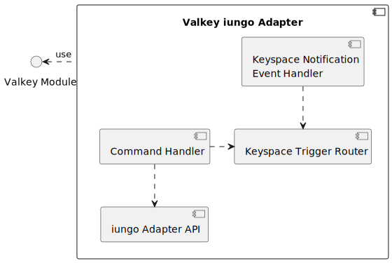

v2025.10


Velkey iungo Adapter
===




## 1 目的與要求
⠿ 接收 Valkey Key 異動事件，並觸發資料處理程序，同時接受 iungo 管理資料處理程序及相關配置。

### 1.1 要求
   1. 本方案具備可移植性，不受 Valkey 版本更新影響。
      > 方便直接應用到後續更高的版本。
   2. 可在運行過程中 註冊/更新/刪除/啟用/暫停…等管理處理程序操作。
   3. 處理程序使用直譯式語言 script。
   4. 處理程序可在 Valkey Server 啟動時自行載入並初始化。
   5. [**安全性**] 提供正式環境下，管理處理程序的安全機制。
   6. [**可開發性**] 提供開發階段便利性。

### 1.2 使用場景
⠿ 本方案適合用在需要事件驅動的場景，範圍涵蓋資料鍵值的新增、更新、刪除與逾期失效。下面列舉適合的使用情境：

   * 📑訂單完成交易後，觸發累積活動消費點數或兌換機制。<br>
      ⠿ 註冊訂單更新的事件通知與資料處理腳本，待收到訂單交易異動通知後，由資料處理腳本檢查訂單完成狀態並處理累積活動消費點數邏輯或兌換機制邏輯。
   * 📑玩家離開遊戲後，工作階段(session)失效通知與清理關聯工作階段相關暫存資料。<br>
      ⠿ 註冊遊戲工作階段失效通知與刪除通知的資料理腳本，玩家進入遊戲後建立工作階段資料鍵並設置留存期(time-to-live)；玩家遊戲期間持續更新工作階段資料鍵的留存期，待收到工作階段資料鍵失效通知後，由資料處理腳本處理該工作階段相關暫存資料的清理作業。


## 2 設計構想
⠿ 本方案設計使用 Valkey Module API 方式開發，包含 Valkey Key 異動事件監聽 與 資料處理程序 …等 **資料處理邏輯**；除此之外還包含資料處理腳本管理、鍵匹配模式管理、監聽事件類型管理…等 **iungo 管理模組**。

### 2.1 資料處理邏輯設計
⠿ 資料處理包括**監聽異動事件**、**鍵匹配路由**、**處理資料**三個流程組合，說明如下：

   * **監聽異動事件**：監聽 Valkey keyspace-notifications events 各類型的異動事件，這個流程功能開發以 Valkey Module keyspace-notifications API 為基礎，註冊監聽處理函式。
   * **鍵匹配路由**：依照 Valkey Key pattern (glob-style pattern) 匹配已註冊的資料處理腳本。
   * **處理資料**：使用 Valkey 腳本引擎(Scripting Engine) API，執行 鍵匹配路由 所匹配的資料處理腳本進行資料處理。

下圖表示資料處理各階段流程：


下面程式碼展示 Valkey Module 中操作 keyspace-notifications API 訂閱通知事件與處理通知。

<details>
<summary>訂閱通知事件範例</summary>
<small>

```c
static void KeySpace_PostNotificationXxxxFreePD(void *pd) {
  /* handling key event contentprocessing failed or finished */
}

static void KeySpace_PostNotificationXxxx(ValkeyModuleCtx *ctx, void *pd) {
  /* processing key event content */
}

static int KeySpace_NotificationXxxx(ValkeyModuleCtx *ctx,
                                     int type,
                                     const char *event,
                                     ValkeyModuleString *key){
  ...
  /* processing key notification events */
  int res = ValkeyModule_AddPostNotificationJob(ctx,
              KeySpace_PostNotificationXxxx,
              key,
              KeySpace_PostNotificationXxxxFreePD);
  if (res == VALKEYMODULE_ERR)
    KeySpace_PostNotificationXxxxFreePD(key);
  return VALKEYMODULE_OK;
}

int ValkeyModule_OnLoad(ValkeyModuleCtx *ctx, ValkeyModuleString **argv, int argc) {
  ...
  /* register keyspace notification events */
  if(ValkeyModule_SubscribeToKeyspaceEvents(ctx,
        VALKEYMODULE_NOTIFY_XXXX,
        KeySpace_NotificationXxxx) != VALKEYMODULE_OK){
    return VALKEYMODULE_ERR;
  }
  ...
  return VALKEYMODULE_OK;
}
```
</small>

> 📄**範例說明**：
> 1. 在 ValkeyModule_OnLoad() 進入點中使用 ValkeyModule_SubscribeToKeyspaceEvents() 方法註冊事件類型與自行開發的事件處理方法。上面範例為 KeySpace_NotificationXxxx() 方法。
> 2. 在自行開發的 KeySpace_PostNotificationXxxx() 方法中，使用 ValkeyModule_AddPostNotificationJob() 註冊實際的資料處理操作邏輯方法 與 相關的資源回收方法。上面範例為 KeySpace_PostNotificationXxxx() 方法與 KeySpace_PostNotificationXxxxFreePD() 方法。

> 📄 **ValkeyModule_SubscribeToKeyspaceEvents() 方法中可以訂閱的事件類型**：
> * `VALKEYMODULE_NOTIFY_GENERIC`
> * `VALKEYMODULE_NOTIFY_STRING`
> * `VALKEYMODULE_NOTIFY_LIST`
> * `VALKEYMODULE_NOTIFY_SET`
> * `VALKEYMODULE_NOTIFY_HASH`
> * `VALKEYMODULE_NOTIFY_ZSET`
> * `VALKEYMODULE_NOTIFY_EXPIRED`
> * `VALKEYMODULE_NOTIFY_EVICTED`
> * `VALKEYMODULE_NOTIFY_STREAM`
> * `VALKEYMODULE_NOTIFY_KEYMISS`
>
> 👉 Valkey Module Keyspace Notifications API - <small>[https://valkey.io/topics/modules-api-ref/#section-module-keyspace-notifications-api](https://valkey.io/topics/modules-api-ref/#section-module-keyspace-notifications-api)</small><br>
> 👉 Valkey keyspace notifications - <small>[https://valkey.io/topics/notifications/](https://valkey.io/topics/notifications/)</small><br>

</details>

### 2.2 iungo 管理機制設計
⠿ Valkey iungo Adapter 包含 註冊服務節點 與 同步配置 等管理操作的網路協定，網路協定採用短連線方式操作，減少實作複雜度。

#### 2.2.1 初始化
⠿ Valkey iungo Adapter 初始化時會完成下面兩件事：

   1. 向 iungo 註冊服務位置到指定的 管理命名空間 (managed namespace)。
   2. 同步 routes/scripts/events 相關配置。




#### 2.2.2 接收更新與同步
⠿ Valkey iungo Adapter 內所配置的 routes/scripts/events 的內容主要接受 iungo 管理，採用被動更新方式，在接收到更新通知後，等待同步 routes/scripts/events 的請求回應後，更新配置內容。更新的步驟過程如下：

   1. iungo 透過 Valkey Command 向 Valkey iungo Adatper 發出更新(同步)通知。
   2. Valkey iungo Adapter 請求同步 routes/scripts/events 異動並等待接收回應。
   3. 接收異動的 routes/scripts/events 並進行新增/更新/刪除等管理操作。



> 📌 這個更新機制避免 iungo Adapter 通訊開發過於複雜，僅實作短連線單向客戶端 socket 就可以滿足。

> 📝 設計時仍會另外提供開發用的更新接口，僅使用自定的 Valkey Command 來管理 routes/scripts/events 配置。


### 2.3 未來版本
⠿ 本節列出未來版本計劃或評估實現的功能與初步構想。

1. 支援 cron 配置。<br>
   ⠿ 提供自動化排程，定時對指定的鍵值進行配置、清理或重置。比如：更新每日優惠配額與重置每日兌換暫存紀錄。
   > 👉 Valkey Modules EventLoop API - <small>[https://valkey.io/topics/modules-api-ref/#section-modules-eventloop-api](https://valkey.io/topics/modules-api-ref/#section-modules-eventloop-api)</small>
2. 支援 timer 配置。<br>
   ⠿ 提供計時器支援窗格計時，對指定的鍵值進行窗格彙總。比如：統計每分鐘內統計十分鐘內的網站活動點擊次數。
   > 👉 Valkey Modules Timers API - <small>[https://valkey.io/topics/modules-api-ref/#section-modules-timers-api](https://valkey.io/topics/modules-api-ref/#section-modules-timers-api)</small>
3. 支援心跳機制。<br>
   ⠿ 提供心跳機制確保服務健康狀態。
4. 支援配置持久化。<br>
   ⠿ 提供配置持久化機制，將配置保存到 RDB 內，於初始化時取得，避免 iungo 無法正常工作時，無法於啟動時恢復與重新註冊配置。
   > ⚠️ 若服務關閉時間太久，而配置已有多次迭代，由於關閉期間無法註冊或同步新的配置與資料處理腳本，此時僅使用 RDB 內預先保存的舊配置時，可能會使用舊版本的邏輯處理資料，造成資料無法正確處理或資料不一致的狀況。


## 3 設計考量
  1. ⚠️本方案要求 Valkey Module keyspace-notifications API 版本在 Valkey 版本在 v7.2.0+，支援相容 `ValkeyModule_AddPostNotificationJob` API。
  1. `VALKEYMODULE_NOTIFY_EXPIRED` 事件不保證準時觸發，存在一定延遲。
  2. 觸發事件處理程序允許寫入操作。
  3. ⚠️觸發事件處理程序可能存在無窮迴圈(infinite loops)，需開發者自行負責。
  4. 觸發事件處理程序與異動操作保持原子性。
     > 📌 Valkey Module API `ValkeyModule_AddPostNotificationJob` 強調與 key space notification 操作符合原子性。
  5. 觸發事件處理程序路由結合 Valkey Key 異動事件與 Valkey Key pattern (glob-style pattern) 兩者作為路由。
  6. 本套件註冊到 Valkey Server 後，會監聽所有 Valkey Key 的異動，故須最大程度降低搜尋路由的消耗。


## 4 系統設計
⠿ Valeky iungo Adapter 使用 Valkey Module 框架實作，主要支援鍵異動觸發處理，且同時具備相關管理命令，以及 iungo Adapter API 整合。因此系統分成下面幾個部份：

  * **Keyspace Notifications Event Handler / 通知事件處理函式**<br>
    註冊/接收 Valkey 鍵異動通知事件，鍵與相關資訊將進一步傳送到 Keyspace Trigger Router 內處理。
  * **Keyspace Trigger Router / 觸發程序路由**<br>
    按所接收的事件與鍵匹配模式選定成功匹配的處理腳本，並執行觸發程序腳本。
  * **Command Handler / 命令處理函式**<br>
    實作相關管理命令，比如：與遠端 iungo 同步配置、管理觸發程序、腳本、異動事件…等等。
  * **iungo Adapter API / iungo 整合 API**<br>
    實作 iungo Adapter API，實現遠端節點註冊、從 iungo 同步配置。




### 4.1 Valkey Commands
⠿ 提供一組 Valkey 指令作為管理與維護相關配置。

   * **IUNGO SYNC**<br>
     請求同步配置。
   * **IUNGO TRIGGER SET** *key-pattern* *event-types* *script-name*<br>
     新增/更新觸發程序。
   * **IUNGO TRIGGER UNSET** *key-pattern* *event-types*<br>
     註銷觸發程序。
   * **IUNGO SCRIPT SET** *name* *script*<br>
     新增/更新腳本。
   * **IUNGO SCRIPT UNSET** *name* *script*<br>
     註銷腳本。
   * **IUNGO EVENT SET** *event-types*<br>
     新增/更新通知事件。
   * **IUNGO EVENT UNSET** *event-types*<br>
     註銷通知事件。

### 4.2 iungo APIs
   * list trigger
   * list script
   * list event
   * sync trigger
   * sync script
   * sync event

### 4.3 iungo UI
   * **資料處理腳本管理**：註冊/註銷資料處理腳本。
   * **鍵匹配路由管理**：新增/刪除鍵匹配路由與處理腳本。
   * **監聽事件類型管理**：啟用/停用 Valkey Keyspace-notification events。

